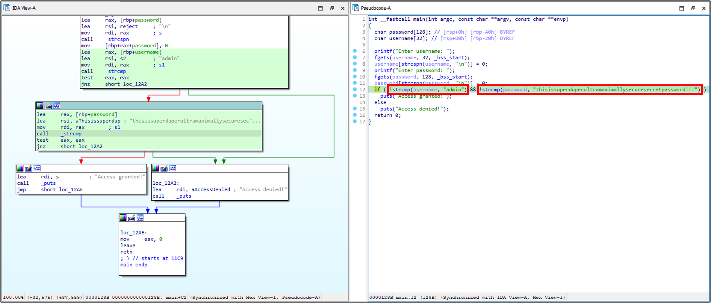
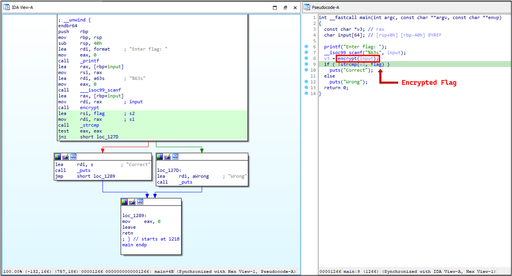
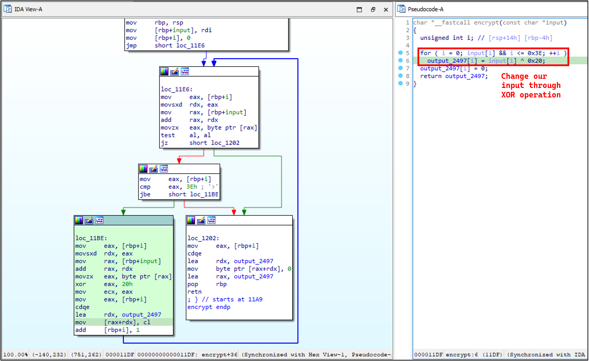
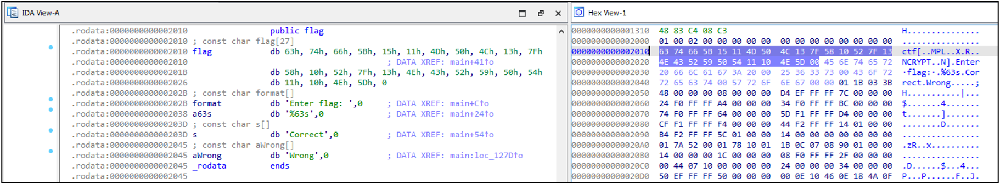
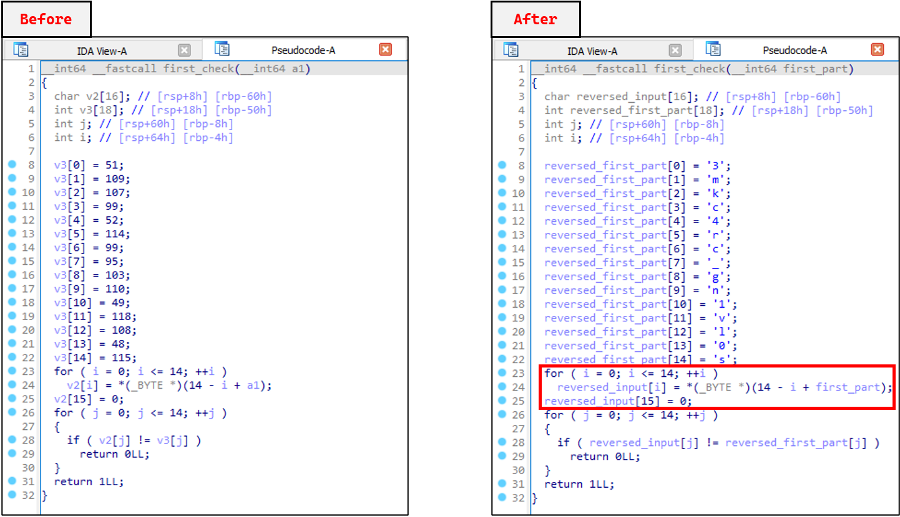
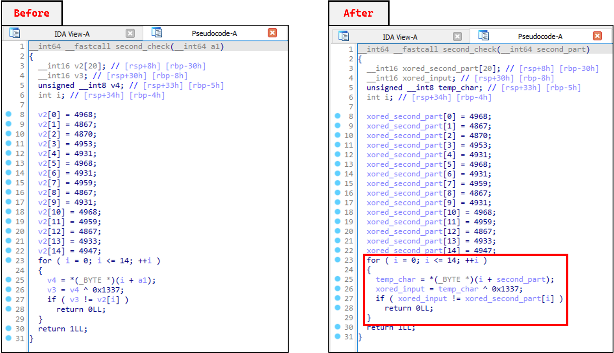

# 📚 Getting Started with Reverse Engineering

This repository consists of learning materials on Reverse Engineering for the [Flag Hunters: CTF Workshop](https://gdg.community.dev/events/details/google-gdg-on-campus-multimedia-university-selangor-malaysia-presents-flag-hunters-ctf-workshop/).

<br/>

## ⚙ Writeup for bin3

```
rydzze ~/FlagHunters ❯ file bin3
bin3: ELF 64-bit LSB pie executable, x86-64, version 1 (SYSV), dynamically linked, interpreter /lib64/ld-linux-x86-64.so.2,
BuildID[sha1]=33979eadcc3ef4a2028c4ba4dbb94acf4577d420, for GNU/Linux 3.2.0, with debug_info, not stripped
```

The main task is to obtain the correct credential for admin and password.



The program first asks for a username and compares the user's input against the hardcoded string `admin` using strcmp. If the username is correct, it then prompts for a password. The critical part of the analysis is identifying the second strcmp function call.

Here, the program compares the user-provided password with a very long, hardcoded string which is `thisissuperduperultramaximallysecuresecretpassword!!!`.

The goal is to identify these hardcoded strings, `admin` for the username and `thisissuperduperultramaximallysecuresecretpassword!!!` for the password from the disassembly or pseudocode. By providing these exact credentials, the strcmp calls will return zero, leading the program to jump to the code block that prints "Access granted!".

### 🏳 Flag

`thisissuperduperultramaximallysecuresecretpassword!!!`

<br/>

## ⚙ Writeup for bin4

```
rydzze ~/FlagHunters ❯ file bin4
bin4: ELF 64-bit LSB pie executable, x86-64, version 1 (SYSV), dynamically linked, interpreter /lib64/ld-linux-x86-64.so.2,
BuildID[sha1]=9d0a5a7f43756437c7bccccdb695ed908c9408db, for GNU/Linux 3.2.0, with debug_info, not stripped
```

The main task is to reverse the encryption process to retrieve the original plaintext flag.



The first image shows the main function's logic. The program prompts the user to "Enter Flag:". It then reads the user's input and passes it to an encrypt function. The **result of this encryption is then compared against a hardcoded encrypted flag value** using strcmp.

If the encrypted user input matches the hardcoded encrypted flag, the program prints "Correct"; otherwise, it prints "Wrong". This confirms that the correct plaintext flag, when encrypted, must equal the hardcoded encrypted flag stored in the binary. Our goal is to find this hardcoded value and decrypt it.



The second image is a deep dive into the encrypt function, which is the key to solving this challenge. The pseudocode reveals a simple loop that iterates through the input string. The encryption operation is `output_2497[i] = input[i] ^ 0x20;`.

This is a **bitwise XOR operation** where each character of the input string is XORed with the hexadecimal value 0x20. A key property of XOR is that it's its own inverse - (A ^ B) ^ B = A. Therefore, to decrypt the hardcoded flag, we simply need to **apply the same XOR operation on each character of the encrypted flag with the key** `0x20`.



The third image shows the .rodata section of the binary, which is where hardcoded, read-only data is stored. Here, **we can find the encrypted flag**. The hex view + disassembly show the string flag and the bytes following this label, which represent the encrypted flag.

To find the correct flag, we must **XOR each of these hexadecimal values with the key** `0x20`. For example, the first byte `0x63` XORed with `0x20` gives `0x63 ^ 0x20 = 0x4D` which is 'C' in ASCII. Applying this process to the entire byte sequence reveals the plaintext flag. This is the reversal of the encryption logic from the encrypt function.

### ✨ Solution

```py
original_flag = ''
encrypted_flag = [0x63, 0x74, 0x66, 0x5B, 0x15, 0x11, 0x4D, 0x50, 0x4C, 0x13, 0x7F, 0x58, 0x10, 0x52, 0x7F, 0x13, 0x4E, 0x43, 0x52, 0x59, 0x50, 0x54, 0x11, 0x10, 0x4E, 0x5D, 0x00]

for i in range(len(encrypted_flag)):
    recovered_char = encrypted_flag[i] ^ 0x20
    original_flag += chr(recovered_char)
    
print(original_flag)
```

### 🏳 Flag

`CTF{51mpl3_x0r_3ncrypt10n}`

<br/>

## ⚙ Writeup for crackme

```
rydzze ~/FlagHunters ❯ file crackme
crackme: ELF 64-bit LSB pie executable, x86-64, version 1 (SYSV), dynamically linked, interpreter /lib64/ld-linux-x86-64.so.2,
BuildID[sha1]=39b316b84fbe140ab3dbfcc4ce260ce87fba29cf, for GNU/Linux 3.2.0, not stripped
```

The goal is to **determine the correct flag** that satisfies a series of validation checks. The process involves analyzing three main functions: the main function and two helper functions, first_check and second_check


The main function's pseudocode reveals the overall logic for flag validation. The program first prompts the user to "Enter Flag:" and reads a maximum of 64 characters. It then performs several checks in a single if statement.

The checking process involve two sub-functions: `first_check(first_part)` and `second_check(second_part)`. It appears the **user-input flag is divided into a first_part and a second_part**, which are then passed to these functions for validation.

The success message "Correct Flag" is only displayed if all these conditions are met, including a string comparison `strcmp(input, "MMU")` and `input[input_len - 1] == '}'`. This suggests the flag starts with a fixed string and ends with a closing curly brace.



The first_check function takes a portion of the user's input as an argument. The key logic lies in a loop that iterates over the input.

It compares each character of the input to a hardcoded array of values. The crucial part of the code is the first for-loop, which indicates that the **input part is being reversed before being compared against a hardcoded array of characters**.

To find the correct first part of the flag, we need to **take the hardcoded characters and apply the reverse operation**. This means the correct first_part is the reversed string of these characters.



The second_check function validates the second part of the flag. The logic here is an XOR cipher.

The code iterates through the input and applies the operation `xored_input[i] = input[i] ^ 0x1337`. It then compares the result to a hardcoded array of values, `xored_second_part`. To find the correct second part of the flag, we **need to reverse this process**.

By **taking the hardcoded values from the xored_second_part array and XORing each value** with `0x1337`, we will get the correct plaintext characters for the second part of the flag. For example, 4968 ^ 0x1337 will yield the first character. 

That said, the **final flag** is the **concatenation of the strings derived from reversing the first_check part and decrypting the second_check part**, all while keeping in mind the known starting and ending characters.

### ✨ Solution

```py
original_flag = ''
reversed_first_part = ['3', 'm', 'k', 'c', '4', 'r', 'c', '_', 'g', 'n', '1', 'v', 'l', '0', 's']
xored_second_part = [4968, 4867, 4870, 4953, 4931, 4968, 4931, 4959, 4867, 4931, 4968, 4959, 4867, 4933, 4947]

original_flag += 'MMU{'
original_flag += ''.join(reversed_first_part[::-1])
original_flag += ''.join(chr(char ^ 0x1337) for char in xored_second_part)
original_flag += '}'

print(original_flag)
```

### 🏳 Flag

`MMU{s0lv1ng_cr4ckm3_41nt_th4t_h4rd}`